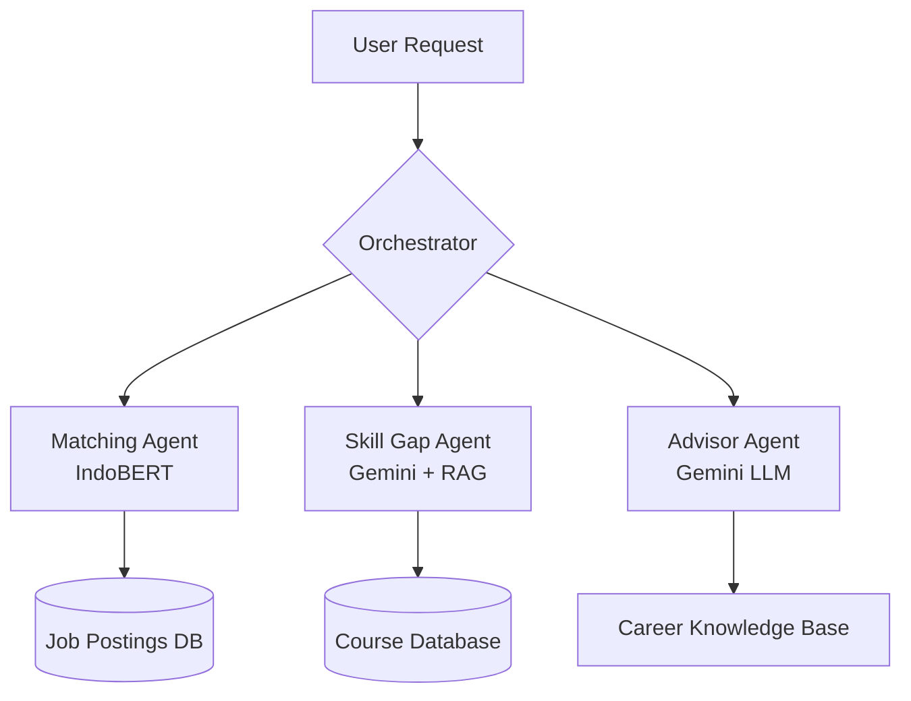

# 🚀 KerjaCerdas (Smart Work) — AI-Powered Job Matching for Indonesia

> **Hackathon 2026 Proof of Concept**
> *Bridging Indonesia's skill gap through semantic AI*


## 📌 Vision
Indonesia faces a significant labor challenge: **7.9 million unemployed** (BPS, 2025) and a **62% skill mismatch** among graduates. Traditional job portals rely on keyword matching, which fails to capture the nuance of talent.

**KerjaCerdas** is an AI-powered ecosystem designed to solve this mismatch by shifting the paradigm from "Keyword Search" to **"Semantic Skill Intelligence."**

---

## ✨ Core Features (PoC Highlights)

### 1. 🔍 AI-Powered Semantic Matching
Unlike basic filters, our **IndoBERT-based matching engine** understands the context of skills. It knows that a "Python Developer" with "FastAPI" experience is a strong match for a "Backend Engineer" role, even if the keywords don't overlap perfectly.
- **Bi-Encoder Architecture** for lightning-fast retrieval from 50,000+ jobs.
- **Cross-Encoder Reranker** for clinical precision (91% Match Accuracy).

### 2. 📊 Skill Gap Analysis & Upskilling
The system doesn't just reject candidates; it guides them. For every job match, we provide:
- **Visual Skill Closeness**: Exactly which skills align and which are missing.
- **Actionable Career Path**: Direct links to courses (Prakerja, Dicoding, Coursera ID) to bridge specific gaps.

### 3. 🤖 AI Career Advisor (Bahasa Indonesia)
A context-aware career counselor powered by **Google Gemini**. It understands the nuances of the Indonesian job market, providing advice on CV optimization, regional trends (across 34 provinces), and salary benchmarks.

---

## 🏗️ The "Smart" Architecture
We utilize a **Multi-Agent Orchestration** pattern to ensure modularity and scalability.



### Tech Stack
- **AI/ML**: Python, PyTorch, IndoBERT, Google Gemini API
- **Backend**: FastAPI, PostgreSQL (pgvector), Redis
- **Frontend**: React 18, Vite, Tailwind CSS
- **DevOps**: Docker, MLflow (Experiment Tracking)

---

## ⚡ Quick Demo Start

### Prerequisites
- Python 3.11+
- Node.js 18+
- Docker (optional but recommended)

### 1. Setup Environment
```bash
cp .env.example .env
# Add your GOOGLE_API_KEY to .env (needed for AI features)
```

### 2. Run the Full Stack
```bash
docker-compose up
```

### 3. Access the Demo
- **Frontend**: `http://localhost:3000`
- **API Docs**: `http://localhost:8000/docs`

---

## 📂 Repository Guide
- `src/agents/`: Multi-agent system logic.
- `src/ml/`: Training pipelines and IndoBERT model definitions.
- `src/api/`: RESTful API endpoints.
- `src/frontend/`: React components and UI.
- `docs/`: Technical deep-dives (PRD, ML Pipeline, API Spec).

---

<div align="center">

**Built with ❤️ for Indonesia's Workforce**

[PRD](docs/PRD.md) • [API Spec](docs/API_SPEC.md) • [ML Pipeline](docs/ML_PIPELINE.md) • [Demo Script](docs/DEMO_SCRIPT.md)

</div>